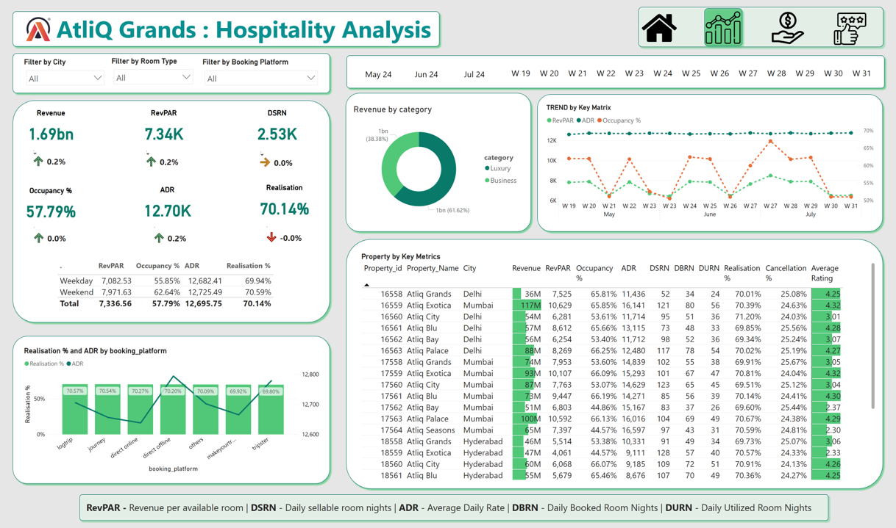

# 👋 Hi, I'm Boniface Boben  
Lead Data Analyst | Data-Driven Decision Making | Transforming Insights into Impact  

<!--Section 1: Introduction-->

## 🌟 About Me  
I'm a Lead Data Analyst at Rows & Columns, passionate about transforming raw data into actionable insights.  
Skilled in **Power BI**, **Excel**, **DAX**, and **SQL**, I build dynamic dashboards, streamline reporting workflows, and support data-driven decision-making.  
I bring a versatile approach to data storytelling, stakeholder engagement, and team leadership, with experience spanning business and sports analytics.  
🚀 Let’s turn data into impactful stories!  

<!--Mention Education-->

## 🎓 Education  
- **B.Tech in Electronics and Communication**  
  Eranad Knowledge City Technical Campus, Manjeri  
  *2015 – 2019*  

## 🛠 Tools & Skills  
 
 
 
 
  

<!-- Mention Project-->

## 📊 Projects  

### BI 360 – [Power BI and MySQL]  
🌍 AtliQ's global expansion led to complex challenges and losses in Latin America.  
🔍 We developed interactive Power BI dashboards for finance, sales, marketing, supply chain, and executive insights.  
📈 Empowered AtliQ with data-driven strategies for growth.  
  
[🔗 View Dashboard](https://app.powerbi.com/view?r=eyJrIjoiYWExYzc0MTAtODU3NS00OTZhLWEwZjEtYzBjNTRjNjViODUwIiwidCI6ImM2ZTU0OWIzLTVmNDUtNDAzMi1hYWU5LWQ0MjQ0ZGM1YjJjNCJ9)  

---

### Hospitality Analysis – [Power BI and Excel]  
🏨 AtliQ Grands faced declining market share and revenue due to poor management decisions.  
💡 Developed interactive dashboards to analyze key metrics, including RevPAR, ADR, and occupancy.  
📊 Insights supported decision-making for enhanced performance.  
  
[🔗 View Dashboard](https://app.powerbi.com/view?r=eyJrIjoiODE4NDQyNTMtOTJmZC00MjRiLWI4MWUtNTFlZGRhZDIwYjQ3IiwidCI6ImM2ZTU0OWIzLTVmNDUtNDAzMi1hYWU5LWQ0MjQ0ZGM1YjJjNCJ9&pageName=931b63cfc48963c6886a)  

 
<!--Contact -->

## 📫 CONTACT DETAILS

*Let’s connect and see how we can make a difference together!*
<table>
  <tbody>
    <tr>
      <td>📧</td>
      <td><a href="boniboban@gmail.com">boniboban@gmail.com</a></td>
    </tr>
    <tr>
      <td>📞</td>
      <td>(+91) 828-985-4724</td>
    </tr>
    <tr>
      <td>📍</td>
      <td>Malappuram, Kerala</td>
    </tr>
    <tr>
      <td>⬇️</td>
      <td><a href="Boniface_Data_Analyst.pdf">Download my CV</a></td>
    </tr>
    <tr>
      <td>🌐</td>
      <td><a href="www.linkedin.com/in/boniboban">Lets connect on LinkedIn</a></td>
    </tr>
  </tbody>
</table>

