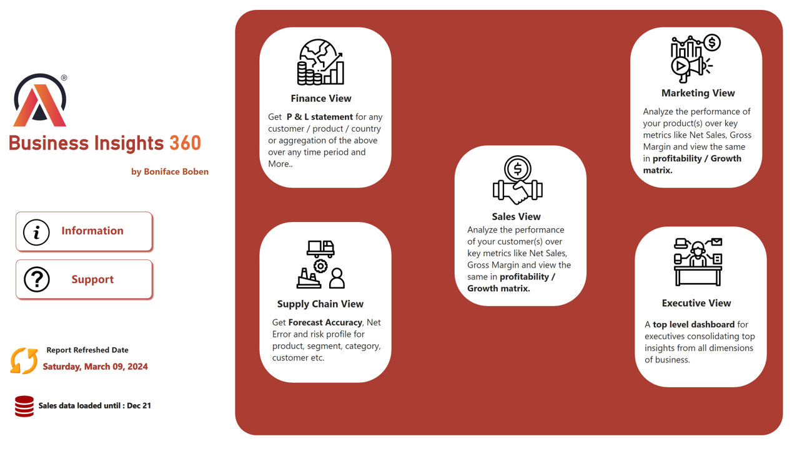
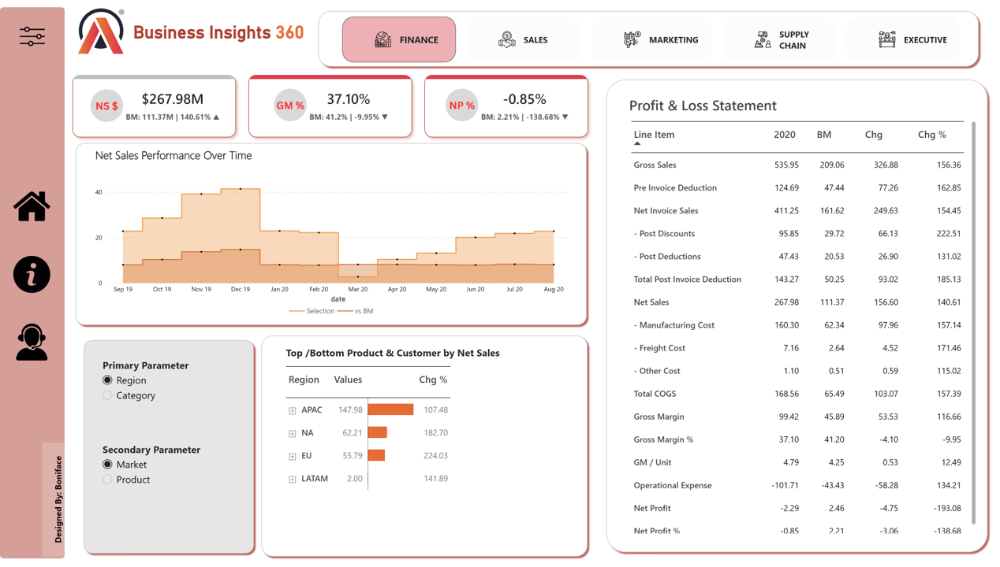

<!--Section 1: Introduction-->
## ABOUT ME

Lead Data Analyst at Rows & Columns with a passion for transforming raw data into actionable insights. 
I am skilled in Power BI, Excel, DAX, and SQL and specialize in building dynamic dashboards, streamlining reporting workflows, and enabling data-driven decisions.

With experience in business and sports analytics, I bring a versatile approach to data storytelling, stakeholder engagement, and team leadership. 
Let’s connect to turn data into impactful stories!

<!--Mention Projects-->

## EDUCATION

Eranad Knowledge City Technical
Campus, Manjeri, B.Tech in Electronics and Communication 2015 – 2019

## 🛠 TOOLS & SKILLS

***POWER BI*** | ***MS EXCEL*** | ***SQL*** | ***TABLEAU*** | ***PYTHON*** 
- **Data Cleaning and Transformation**
- **Stakeholder Management and Leadership**

<!-- Relevent Skills-->

## 📊 PROJECTS

- **BI 360 – [Power BI and MySQL]**
  
AtliQ's rapid global expansion led to complex challenges and significant losses in Latin America due to inefficient, Excel-based analytics. To enhance decision-making, we developed dynamic Power BI dashboards covering finance, sales, marketing, supply chain, and executive insights. This transition empowers AtliQ with data-driven strategies for growth and performance optimization. 

[View Dashboard](https://app.powerbi.com/view?r=eyJrIjoiYWExYzc0MTAtODU3NS00OTZhLWEwZjEtYzBjNTRjNjViODUwIiwidCI6ImM2ZTU0OWIzLTVmNDUtNDAzMi1hYWU5LWQ0MjQ0ZGM1YjJjNCJ9)

- **Hospitality Analysis – [Power BI and Excel]**  
  AtliQ Grands has been facing declining market share and revenue due to poor competition and management decisions. The project aims to boost market share and revenue in the luxury hotel segment through data-driven strategies and business intelligence. Key metrics analyzed include revenue, RevPAR, ADR, DSRN, DBRN, DURN, realization percentage, occupancy percentage, and cancellation percentage. I developed interactive dashboards to support informed decision-making using advanced Power BI techniques like calculated columns, data modeling, page navigation, bookmarks, DAX, and M Language. These insights help AtliQ Grands enhance performance and regain a competitive edge.

[View Dashboard](https://app.powerbi.com/view?r=eyJrIjoiODE4NDQyNTMtOTJmZC00MjRiLWI4MWUtNTFlZGRhZDIwYjQ3IiwidCI6ImM2ZTU0OWIzLTVmNDUtNDAzMi1hYWU5LWQ0MjQ0ZGM1YjJjNCJ9&pageName=931b63cfc48963c6886a)

<!-- Relevent Skills-->

- Power BI, Tableau  
- Excel, SQL, Python (Pandas, NumPy)  
- Data Cleaning & Visualization  

<!--Contact -->

## 📫 Contact

📧 boniboban@gmail.com 
🔗 [LinkedIn](https://linkedin.com/in/boniface)  
🌐 [GitHub](https://github.com/boniface)

